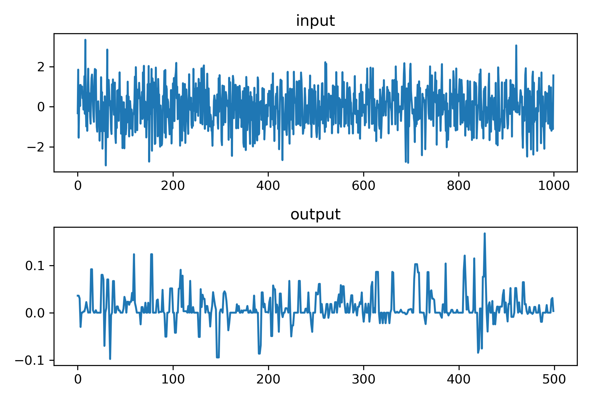

# Rolling Quantiles for NumPy
## Hyper-efficient and composable filters.

* Simple, clean, intuitive interface.
* Supports streaming data or bulk processing.
* Python 3 bindings for a compact library written in pure C.

### A Quick Tour

Let me give you but a superficial overview of this module's elegance.

```python
import numpy as np
import rolling_quantiles as rq

pipe = rq.Pipeline( # rq.Pipeline is the only stateful object
  # declare a cascade of filters by a sequence of immutable description objects
  rq.LowPass(window=200, portion=100, subsample_rate=2),
    # the above takes a median (100 out of 200) of the most recent 200 points
    # and then spits out every other one
  rq.HighPass(window=10, portion=3,  subsample_rate=1))
    # that subsampled rolling median is then fed into this filter that takes a
    # 30% quantile on a window of size 10, and subtracts it from its raw input

# the pipeline exposes a set of read-only attributes that describe it
pipe.lag # = 60.0, the effective number of time units that the real-time output
         #   is delayed from the input
pipe.stride # = 2, how many inputs it takes to produce an output
            #  (>1 due to subsampling)


input = np.random.randn(1000)
output = pipe.feed(input) # the core, singular exposed method

# every other output will be a NaN to demarcate unready values
subsampled_output = output[1::pipe.stride]
```


That may be a lot to take in, so let me break it down for you:
* `rq.Pipeline(description...)` constructs a filter pipeline from one or more filter descriptions and initializes internal state.
* `.feed(*)` takes in a Python number or `np.array` and its output is shaped likewise.
* The two filter types are `rq.LowPass` and `rq.HighPass` that compute rolling quantiles and return them as is, and subtract them from the raw signal respectively. Compose them however you like!
* `NaN`s in the output purposefully indicate missing values, usually due to subsampling. If you pass a `NaN` into a `LowPass` filter, it will slowly deplete its reserve and continue to return valid quantiles until the window empties completely.

I also expose a convenience function `rq.medfilt(signal, window_size)` at the top-level of the package to directly supplant `scipy.signal.medfilt`.

That's it! I detailed the entire library. Don't let the size of its interface fool you!

## Installation

If you are running MacOS with Python 3.8+, execute the following:

`pip install rolling-quantiles`

I plan on uploading binaries for most common platforms to the Python Package Index---that holds `pip`'s packages---soon. Until then, building the package from source should be straightforward.

### Building from Source

The meat of this package is a handful of C files with no external dependencies, besides NumPy 1.16+ and Python 3.7+ for the bindings located in `src/python.c`. As such, you may build from source by running the following from the project's root directory:
1. `cd python`
2. Check `pyproject.toml` to make sure the listed NumPy version matches your desired target.
3. `python -m build` (make sure this invokes Python 3)
4. `pip install dist/<name_of_generated_wheel_file>.whl`

#### Note of Caution on MacOS Big Sur
Make sure to specify `MACOSX_DEPLOYMENT_TARGET=10.X` as a prefix to the build command, e.g. `python -m build`. The placeholder `X` can be any MacOS version earlier than Big Sur (I use `9`.) By default, the build system would attempt to build for MacOS 11 that is incompatible with current Python interpreters that have been compiled against a prior version.


### Benchmarking a median filter on 100 million doubles.

I make use of binary heaps that impart desirable guarantees on their amortized runtime. Realistically, their performance may depend on the statistics of the incoming signal. I pummeled the filters with Gaussian Brownian motion to gauge their practical usability under a typical drifting stochastic process.

| `window` | `rolling_quantiles.Pipeline(...)` | `scipy.signal.medfilt(...)` |
| :------- | --------------------------------: | --------------------------: |
| 10       | 12 seconds                        | 44 seconds                  |
| 20       | 15 seconds                        | 88 seconds                  |
| 30       | 18 seconds                        | 134 seconds                 |
| 40       | 18 seconds                        | 184 seconds                 |
| 50       | 19 seconds                        | 237 seconds                 |
| 1,000    | 33 seconds                        | N/A                         |

16-inch 2020 MacBook Pro, single-threaded performance

#### Brought to you by [Myrl](https://myrl.marmarel.is)
